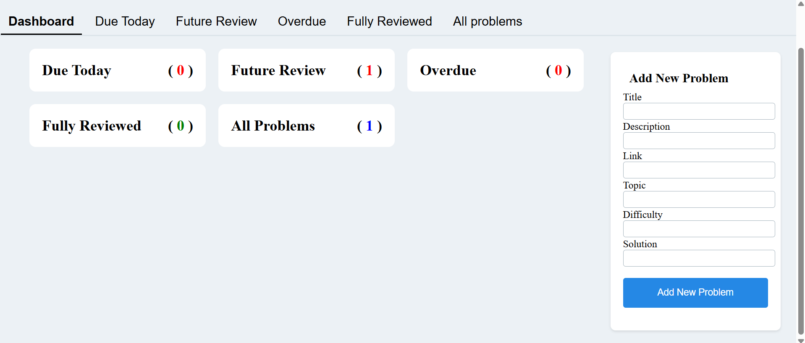
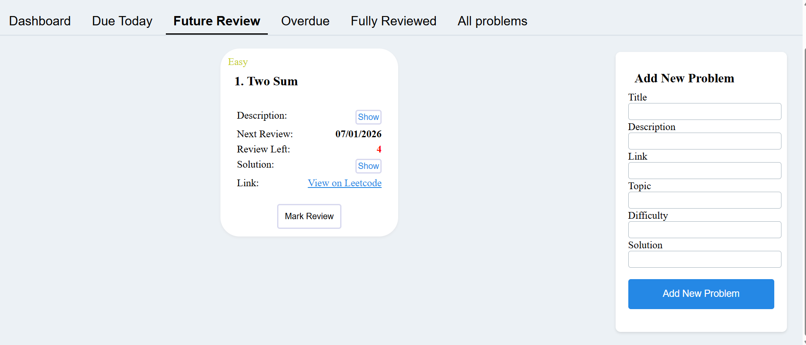

# LeetCode Tracker

A personal tracker for coding practice on LeetCode.  
Keep a structured record of the problems you have already solved, along with review history and completion status.

---

## 🚀 Project Description

LeetCode Tracker is a full-stack application that helps developers organize coding practice using spaced repetition. Instead of manually remembering which problems to revisit, the application automatically schedules future reviews based on previous review activity.

Problems are automatically scheduled for review and categorized into:

- **Due Today** – Problems scheduled for review today  
- **Overdue** – Problems you missed reviewing on time  
- **Upcoming Reviews** – Problems scheduled for future review  

---

## 🧩 Architecture

The application is a full-stack solution:

### Backend
- Build a Restful API using **Spring Boot**
- Uses **PostgreSQL** for data persistence  
- Scheduling logic automatically updates review intervals based on user activity. When a user reviews a problem, the backend automatically calculates the next review date based on the review outcome. This enables a spaced repetition workflow without manual scheduling. 

### Frontend
- Built with **React**
- Provides a responsive and interactive interface for viewing, adding, and reviewing problems  

---

## 🛠 Tech Stack

**Frontend:**
- React
- JavaScript
- Axios
---

**Backend:**
- Java
- Spring Boot
- Spring Data JPA (Hibernate)
---

**Database:**
- PostgreSQL
   
**DevOps** 
- Docker  
- Render  

---

## ✨ Features

### ✅ Current Features
- Jwt Authentication
- CRUD operations for coding problems
- Track problems by status: Today, Future, Overdue  
- Review history with timestamps and notes  
- Mark problems as completed and automatically update progress  
- Full-stack React interface with dynamic updates  

### 🌟 Future Features
- Weekly/monthly progress charts  
- Problem difficulty and tag filtering  
- Email notifications for overdue problems  
- Social sharing and friend challenges  

---


###  ✅ API Section
```bash
## API Endpoints

POST   /api/problems
GET    /api/problems
PUT    /api/problems/{id}
DELETE /api/problems/{id}

GET /api/reviews/today
GET /api/reviews/overdue
GET /api/reviews/upcoming
```

---

### 💻 Running Locally

### 🔧 Backend

1️⃣ Clone the repository
```bash
git clone https://github.com/wankoutecto/Leetcode-tracker.git
```
2️⃣ Set up PostgreSQL

Create a database (example: leetcode_db)

Update application.properties in src/main/resources/:
```bash
spring.datasource.url=jdbc:postgresql://localhost:5432/leetcode_db
spring.datasource.username=your_username
spring.datasource.password=your_password
spring.jpa.hibernate.ddl-auto=update
```
spring.jpa.hibernate.ddl-auto=update ensures tables are created automatically if they don’t exist.

3️⃣ Build & run backend

Navigate to the backend folder:
```bash
cd ../Tracker_backend
```
Windows (PowerShell):
```bash
.\mvnw.cmd clean install
.\mvnw.cmd spring-boot:run
```
Linux / WSL:
```bash
./mvnw clean install
./mvnw spring-boot:run
```

### 🎨 Frontend

Navigate to frontend folder
```bash
cd ../Tracker_frontend
```
1️⃣ Install dependencies
```bash
npm install
```
2️⃣ Start the frontend
```bash
npm run dev
```
3️⃣ Open in browser

http://localhost:5173/

### 🐳 Docker
#### Run Frontend and Backend
```bash
docker-compose up --build
```
(Assuming you add a docker-compose setup for backend + frontend)

## 📸 Screenshots

Dashboard


Future review’s Problems:



