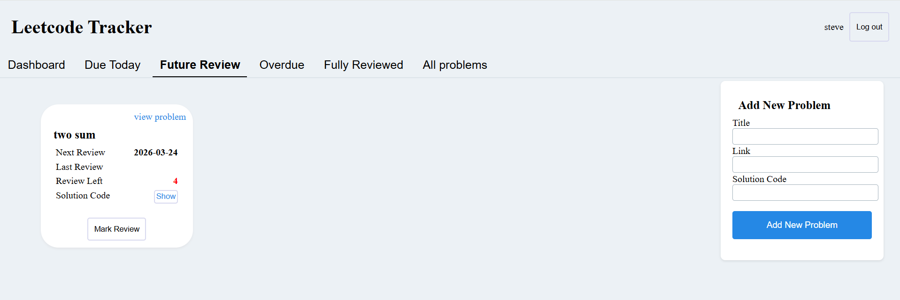

# LeetCode Tracker

A personal tracker for coding practice on LeetCode.  
Keep a structured record of the problems you have already solved, along with review history and completion status.

---

## 🚀 Project Description

LeetCode Tracker helps users track and review LeetCode problems using a **spaced repetition approach**.

Problems are automatically scheduled for review and categorized into:

- **Due Today** – Problems scheduled for review today  
- **Overdue** – Problems you missed reviewing on time  
- **Upcoming Reviews** – Problems scheduled for future review  

---

## 🧩 Architecture

The application is a full-stack solution:

### Backend
- Implemented with **Spring Boot**
- Uses **PostgreSQL** for data persistence  
- Scheduling logic automatically updates review intervals based on user activity  

### Frontend
- Built with **React**
- Provides a responsive and interactive interface for viewing, adding, and reviewing problems  

---

## 🛠 Tech Stack

- **Frontend:** React  
- **Backend:** Java, Spring Boot, Hibernate  
- **Database:** PostgreSQL  
- **Containerization:** Docker  
- **Deployment:** AWS (EC2)  

---

## ✨ Features

### ✅ Current Features
- Track problems by status: Today, Future, Overdue  
- Review history with timestamps and notes  
- Mark problems as completed and automatically update progress  
- Full-stack React interface with dynamic updates  

### 🌟 Future Features
- Weekly/monthly progress charts  
- Problem difficulty and tag filtering  
- Email notifications for overdue problems  
- Social sharing and friend challenges  

---

## 💻 Running Locally

### 🔧 Backend

1️⃣ Clone the repository
```bash
git clone https://github.com/<your-username>/Leetcode-tracker.git
cd Leetcode-tracker/Tracker_backend
```
2️⃣ Set up PostgreSQL

Create a database (example: leetcode_db)

Update application.properties in src/main/resources/:
```bash
spring.datasource.url=jdbc:postgresql://localhost:5432/leetcode_db
spring.datasource.username=your_username
spring.datasource.password=your_password
spring.jpa.hibernate.ddl-auto=update
```
spring.jpa.hibernate.ddl-auto=update ensures tables are created automatically if they don’t exist.

3️⃣ Build & run backend

Windows (PowerShell):
```bash
.\mvnw.cmd clean install
.\mvnw.cmd spring-boot:run
```
Linux / WSL:
```bash
./mvnw clean install
./mvnw spring-boot:run
```

🎨 Frontend

Navigate to frontend folder
cd ../Tracker_frontend

1️⃣ Install dependencies
```bash
npm install
```
2️⃣ Start the frontend
```bash
npm run dev
```
3️⃣ Open in browser

http://localhost:5173/

🐳 Docker
```bash
docker-compose up --build
```
(Assuming you add a docker-compose setup for backend + frontend)

### 📸 Screenshots

Dashboard


Future review’s Problems:



