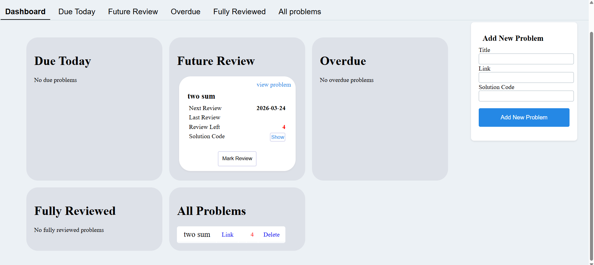

Leetcode tracker:
A personal tracker for coding practice on leetcode. Keep a structured record of the problems you have already solved, along with review history and completion status.

Project Description
LeetCode Tracker helps users track and review LeetCode problems using a spaced repetition approach. Problems are automatically scheduled for review based on when they should be revisited, and are categorized into:
Due Today – Problems scheduled for review today
Overdue – Problems you missed reviewing on time
Upcoming Reviews – Problems scheduled for future review

The application is a full-stack solution:
Backend: Implemented with Spring Boot, with PostgreSQL for data persistence. The scheduling logic automatically updates review intervals based on user activity, ensuring efficient and structured practice.
Frontend: Built with React, providing a responsive and interactive interface for viewing, adding, and reviewing problems.

🛠Tech Stack
Frontend: React
Backend: Java, Spring Boot, Hibernate
Database: PostgreSQL
Containerization: Docker
Deployment: AWS (EC2)

Features
✅ Current Features
Track problems by status: Today, Future, Overdue
Review history with timestamps and notes
Mark problems as completed and automatically update progress
Full-stack React interface with dynamic updates
🌟 Future Features
Weekly/monthly progress charts
Problem difficulty and tag filtering
Email notifications for overdue problems
Social sharing and friend challenges

💻Running Locally
Running the Backend
1️⃣ Clone the repository
git clone https://github.com/<your-username>/Leetcode-tracker.git
cd Leetcode-tracker/Tracker_backend
2️⃣ Set up PostgreSQL
Create a database (example: leetcode_db) in PostgreSQL.
Update application.properties in src/main/resources/ with your credentials:
spring.datasource.url=jdbc:postgresql://localhost:5432/leetcode_db
spring.datasource.username=your_username
spring.datasource.password=your_password
spring.jpa.hibernate.ddl-auto=update
*spring.jpa.hibernate.ddl-auto=update ensures that tables are created automatically if they don’t exist.
3️⃣ Build & run backend
Using Maven Wrapper.
*Make sure you are in the backend folder (where pom.xml and mvnw.cmd live).
Type these commands:
From PowerShell (Windows):
.\mvnw.cmd clean install
.\mvnw.cmd spring-boot:run
From WSL/Linux:
./mvnw clean install
./mvnw spring-boot:run

Running the Frontend
Navigate to the frontend folder:
cd ../Tracker_frontend
1️⃣Install dependencies
npm install
2️⃣Start the frontend
npm run dev
3️⃣Open the app in your browser
Once “npm run dev” finishes, open your browser at:
http://localhost:5173/

Docker Option
docker-compose up --build
(Assuming you add a docker-compose setup for backend + frontend)

📸Screenshots

Dashboard / Future review’s Problems:

